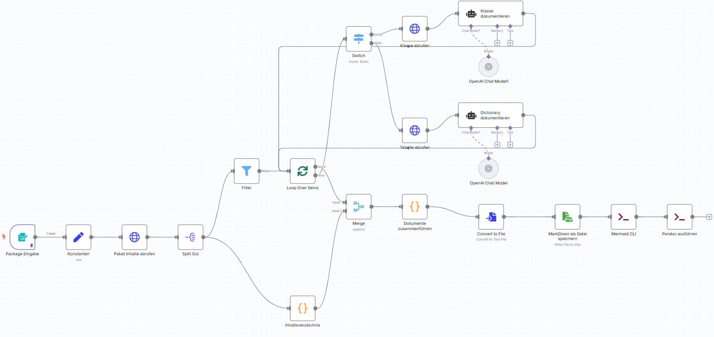

# 📄 Automatische Dokumentation von ABAP-Paketen mit KI

Willkommen! In diesem Repository findest du alle Informationen und Ressourcen, um ABAP-Pakete mithilfe von KI automatisiert zu dokumentieren. 🧠📘

Sieh Dir hier nochmal den Vortrag von der ABAPConf an: https://www.youtube.com/live/SncN0yl2l-0?si=eCaPiLhIoyy6-zAL&t=17700.



## 🚀 1. Tech-Stack installieren

### ⚙️ Node.js 22

Für unseren Tech-Stack wird **Node.js v22** benötigt:  
➡️ [Download-Link](https://nodejs.org/en/download)

💡 **Tipp:** Mit dem Tool `nvm` kannst du mehrere Node-Versionen einfach verwalten.

#### 🪟 Windows

- [nvm-windows herunterladen](https://github.com/coreybutler/nvm-windows)
- Dann im Terminal:

```bash
nvm install 22
nvm use 22
```

MacOS

```Bash
curl -o- https://raw.githubusercontent.com/nvm-sh/nvm/v0.40.3/install.sh | bash
# in lieu of restarting the shell
\. "$HOME/.nvm/nvm.sh"
# Download and install Node.js:
nvm install 22
# Verify the Node.js version:
node -v # Should print "v22.16.0".
nvm current # Should print "v22.16.0".
# Verify npm version:
npm -v # Should print "10.9.2".
```

### 🔄 Lokale n8n Instanz

Wir nutzen n8n als zentrale Plattform für die Workflows. Mehr Informationen zu n8n: https://n8n.io/. 

Empfohlene Installation via npm: https://docs.n8n.io/hosting/installation/npm/

Start und Installation erfolgt über:

```bash
npx n8n
```

Drücke anschließend "o" im Terminal oder rufe "localhost:5678" auf um n8n zu öffnen. 

### 🔑 OpenAI API Schlüssel

Konto erstellen: https://platform.openai.com/login

### Mermaid CLI

```bash
npm install -g @mermaid-js/mermaid-cli
```

### Pandoc installieren

🪟 Windows
```Bash
choco install rsvg-convert python miktex
```

🍎 macOS
```Bash
brew install pandoc
```

Siehe: https://pandoc.org/installing.html

### `ZSWAN_AI_DOC` Service mit abapgit einspielen

Um dieses Projekt zu verwenden, benötigst du [abapGit](https://abapgit.org/). Folge diesen Schritten:

1. Installiere abapGit in deinem ABAP-System.
2. Klone dieses Repository mit abapGit.
3. Folge den abapGit-Anweisungen, um das Projekt zu pullen und zu aktivieren.

➡️ Weitere Informationen findest du in der [abapGit-Dokumentation](https://docs.abapgit.org/).

Stelle anschließend sicher, dass das Paket `ZSWAN_AI_DOC` vorhanden und der Service `ZSWAN_AI_DOC` aktiv ist. 

**Achtung:** Sollte ein Fehler erscheinen das der Service (Binding bzw. Definition) nicht importiert werden konnte, so muss dieser ggf. manuell angelegt werden. 

## ⚙️ 2. Workflow importieren

Im `workflows` Verzeichnis findest du den Vorgestellten Workflow. 
Diesen kannst in n8n einfach Importieren. 
Dort musst Du noch deine System, Zugangsdaten und OpenAI API Schlüssel Informationen hinterlegen. Und schon kann es losgehen. 
Außerdem solltest du das Ausgabeverzeichnis noch anpassen.

## ❓ Fragen?

Bei Fragen wende dich gerne an uns Mario Kernich (mario.kernich@swan.de) oder Calvin Stauber (calvin.stauber@swan.de).

Oder eröffne direkt ein GitHub-Issue – wir freuen uns über dein Feedback! 🙌
